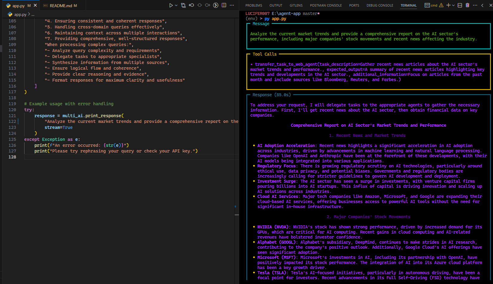

# Agno Agent Tool

A demonstration of the Agno Agent framework for building AI assistants with integrated tool calling capabilities.

## Overview

The Agno Agent is a versatile tool that performs various tasks including information search, text generation, and summarization. This repository showcases how to implement and use the Agno Agent with proper tool call parameters.

## Features

- **Flexible Tool Calling**: Define and execute tool calls with custom parameters
- **Multiple Functions**: Search for information, generate text, summarize content
- **Parameter Validation**: Strong typing support for tool parameters
- **Easy Integration**: Simple API for integrating with your applications

## Tool Call Parameters

| Parameter | Description | Type | Example |
|-----------|-------------|------|---------|
| `tool_name` | Name of the tool | string | "Agno Agent" |
| `tool_description` | Description of the tool's functionality | string | "A tool for various tasks like searching, generating text, etc." |
| `tool_parameters` | List of available tool parameters | array | ["search", "generate", "summarize"] |
| `tool_parameter_descriptions` | Descriptions for each parameter | array | ["Search for information", "Generate text", "Summarize text"] |
| `tool_parameter_types` | Data types for parameters | array | ["string", "string", "string"] |
| `tool_parameter_examples` | Usage examples | array | ["What is the capital of France?", "Write a poem about the sea.", "Summarize the following text: ..."] |

## Demo

Here are some examples of the Agno Agent in action:

## Documentation

For more detailed information, please refer to:

- [Agno Documentation](https://docs.agno.ai)
- [Tool Calling Guide](https://docs.agno.ai/guide/tool-calling)
- [API Reference](https://docs.agno.ai/api)

---

<a href="https://github.com/yashksaini-coder">
    <table>
        <tbody>
            <tr>
                <td align="left" valign="top" width="14.28%">
                    
                     
                    <h4 align="center">
                        <b>Yash K. Saini</b>
                    </h4>
                    

                        
(Author)

                    

                </td>
                <td align="left" valign="top" width="85%">
                    

                        👋 Hi there! I'm <u><em><strong>Yash K. Saini</strong></em></u>, a self-taught software developer and a computer science student from India.
                    

                    <ul>
                     <li>
                        I love building & contributing to Open Source software solutions & projects that help solve real-world problems.
                    </li>
                    <li>
                        I want to build products & systems that can benefit & solve problems for many other DEVs.
                    </li>
                </td>
            </tr>
        </tbody>
    </table>
</a>

    <strong>🌟 If you find this project helpful, please give it a star on GitHub! 🌟</strong>

